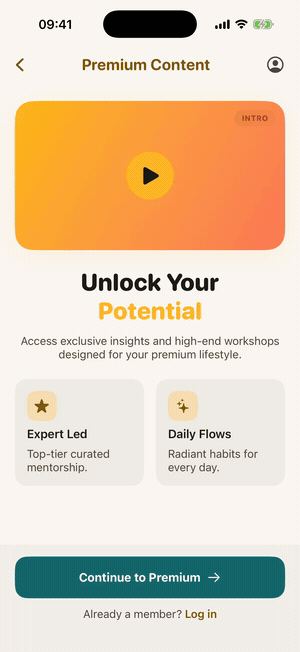
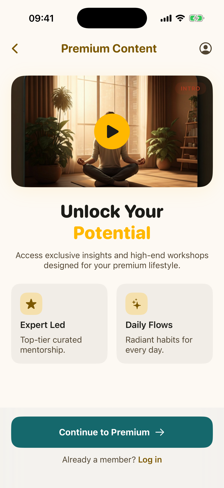
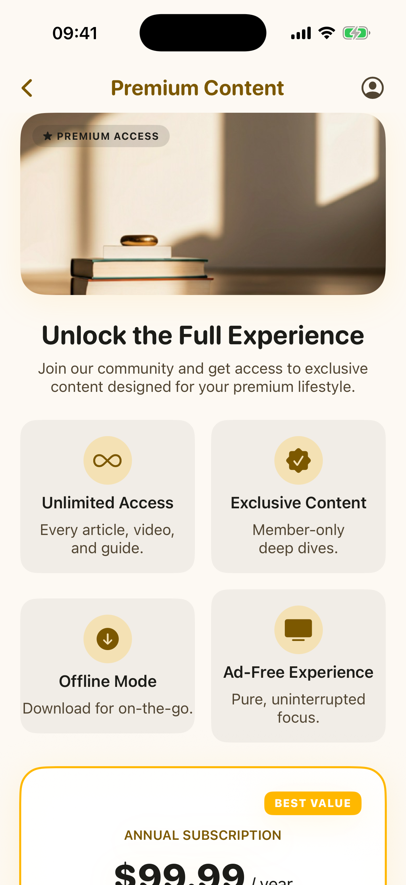
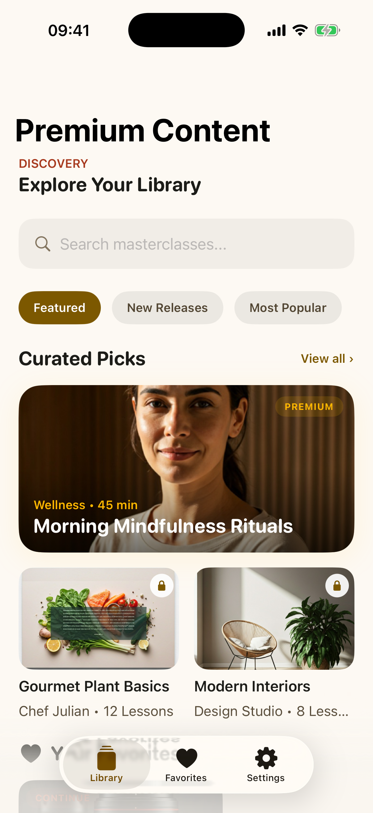
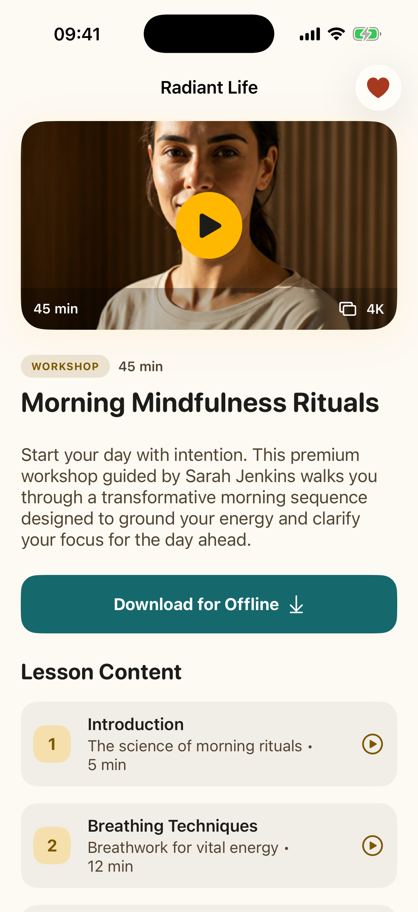
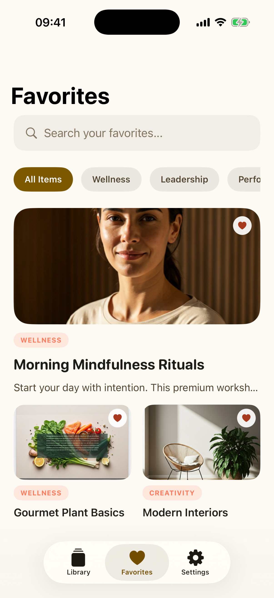
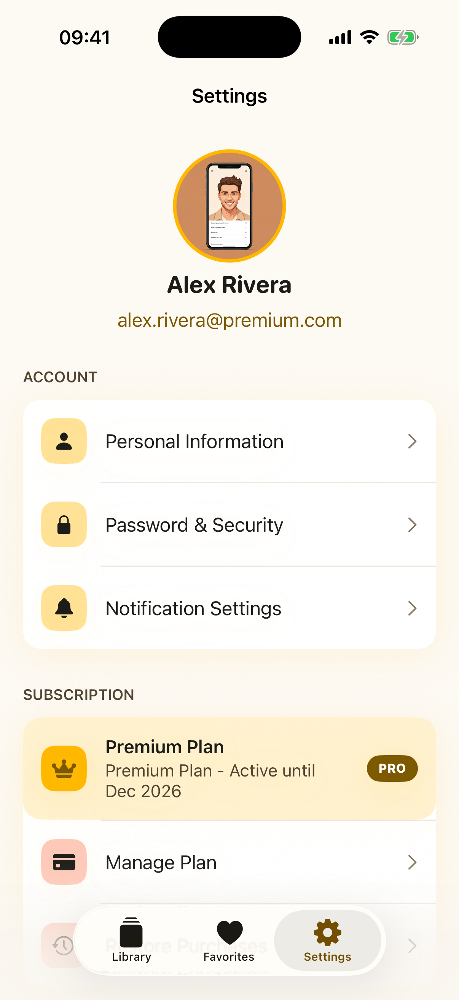
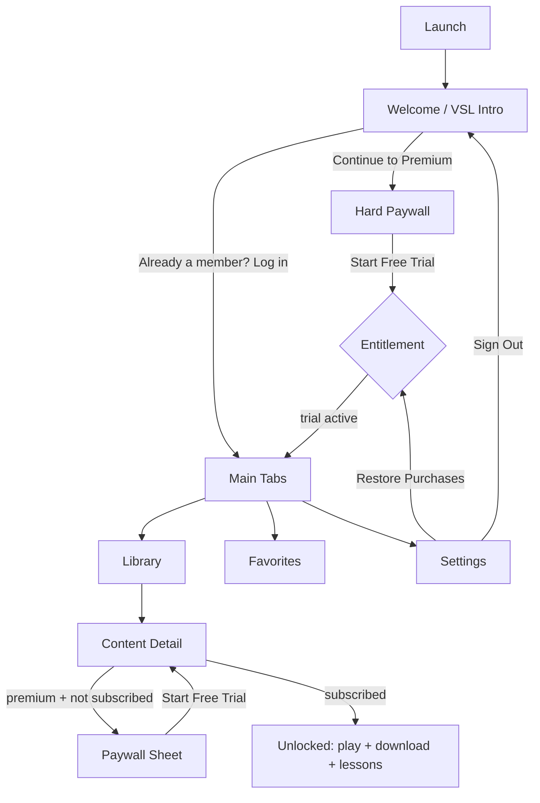

# Radiant Life - SwiftUI Subscription App MVP

An App Store-ready iOS subscription app built in **Swift / SwiftUI**. It covers the full
freemium lifecycle: onboarding with a video/VSL intro, a hard paywall with a 3-day free
trial on an annual plan, premium-gated content, a categorized content library, content
detail pages, favorites, and settings with restore purchases.

The UI is built to match a [Google Stitch](design/DESIGN.md) design ("Solaris" - a warm,
optimistic premium-lifestyle system). The design source (HTML + tokens) lives in [`design/`](design/).



## Screens

| Welcome / VSL Intro | Hard Paywall | Content Library |
|---|---|---|
|  |  |  |

| Content Detail | Favorites | Settings |
|---|---|---|
|  |  |  |

## What it shows

- **Onboarding + VSL intro** - tappable video-style intro card, value props, "Continue to Premium".
- **Hard paywall** - no path past onboarding except converting; annual plan **$99.99/year**,
  **3-day free trial included**, per-month breakdown, restore purchases, legal copy.
- **Subscription integration** - `SubscriptionManager` models the StoreKit 2 / RevenueCat
  flow (`purchase()` -> verified transaction -> entitlement). The calls are simulated so the
  whole flow is demoable on a simulator with no IAP sandbox; swapping in real StoreKit /
  RevenueCat is isolated to that one type.
- **Locked / unlocked premium content** - premium items show a lock + paywall sheet when not
  subscribed; lessons unlock per entitlement. Starting the trial unlocks everything live.
- **Content library** - categories, search, featured carousel, continue-watching with
  progress, latest content.
- **Content detail** - hero player, summary, lesson list with locked rows, daily inspiration.
- **Favorites** - category filter, add/remove, persisted in app state.
- **Settings** - profile, account/support sections, subscription status (PRO/FREE),
  manage plan, restore purchases, sign out.

## Architecture

- **SwiftUI**, iOS 18+, no third-party dependencies.
- **State**: `@Observable` `@MainActor` models injected via `.environment`:
  - `AppState` - onboarding phase gate, catalog, favorites, tab selection.
  - `SubscriptionManager` - plan, entitlement, trial/purchase/restore (StoreKit/RevenueCat seam).
- **Navigation**: `NavigationStack` + type-safe `navigationDestination(for:)`; new `Tab` API.
- **Design system**: `Theme` (colors, typography, spacing, radii, shadows) ported 1:1 from
  the Stitch `DESIGN.md` tokens; reusable `Components` (CTA button, chips, badges, artwork).
- Photography matches the Stitch design - the design's images are bundled in
  `Assets.xcassets` and mapped per content item, with a seeded gradient + SF Symbol fallback
  if an asset is missing.

```
Sources/
  App/            RadiantLifeApp, RootView (phase gate), MainTabView
  DesignSystem/   Theme (Solaris tokens)
  Components/     PrimaryButton, FilterChip, TagBadge, Artwork, LockBadge
  Models/         ContentItem, Lesson, ContentCategory, MockData
  State/          AppState, SubscriptionManager
  Screens/        Welcome, Paywall, Library, ContentDetail, Favorites, Settings
design/           Google Stitch source (DESIGN.md + per-screen HTML)
```

## App flow



## Run

```bash
brew install xcodegen          # if needed
xcodegen generate              # creates RadiantLife.xcodeproj
open RadiantLife.xcodeproj     # build + run on an iOS 18 simulator
```
